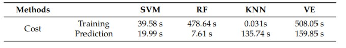

# Literature Survey Notes

## An Automated System for ECG Arrhythmia Detection Using Machine Learning Techniques

### **Abstract:**
The new advances in multiple types of devices and machine learning models provide opportunities for practical automatic computer-aided diagnosis (CAD) systems for ECG classification methods to be practicable in an actual clinical environment. This imposes the requirements for the ECG arrhythmia classification methods that are inter-patient. We aim in this paper to design and investigate an automatic classification system using a new comprehensive ECG database inter-patient paradigm separation to improve the minority arrhythmical classes detection without performing any features extraction. We investigated four supervised machine learning models: support vector machine (SVM), k-nearest neighbors (KNN), Random Forest (RF), and the ensemble of these three methods. We test the performance of these techniques in classifying: Normal beat (NOR), Left Bundle Branch Block Beat (LBBB), Right Bundle Branch Block Beat (RBBB), Premature Atrial Contraction (PAC), and Premature Ventricular Contraction (PVC), using inter-patient real ECG records from MIT-DB after segmentation and normalization of the data, and measuring four metrics: accuracy, precision, recall, and f1-score. The experimental results emphasized that with applying no complicated data pre-processing or feature engineering methods, the SVM classifier outperforms the other methods using our proposed inter-patient paradigm, in terms of all metrics used in experiments, achieving an accuracy of 0.83 and in terms of computational cost, which remains a very important factor in implementing classification models for ECG arrhythmia. This method is more realistic in a clinical environment, where varieties of ECG signals are collected from different patients.
### **Models Used:** 
- SVM
- KNN
- Random Forest

### **Parameters Classified:** 
- Normal beat
- Left Bundle Branch Block Beat
- Right Bundle Branch Block Beat
- Premature Atrial Contraction
- Premature Ventricular Contraction

### **Result:** 

SVM is better than all the other three.  

**Accuracy:** 
- SVM - 0.83
- RF - 0.81
- KNN - 0.78 

**Computational Cost:**



## Automatic classification of heartbeats using ECG morphology and heartbeat interval features

### **Abstract:**
A method for the automatic processing of the electrocardiogram (ECG) for the classification of heartbeats is presented. The method allocates manually detected heartbeats to one of the five beat classes recommended by ANSI/AAMI EC57:1998 standard, i.e., normal beat, ventricular ectopic beat (VEB), supraventricular ectopic beat (SVEB), fusion of a normal and a VEB, or unknown beat type. Data was obtained from the 44 nonpacemaker recordings of the MIT-BIH arrhythmia database. The data was split into two datasets with each dataset containing approximately 50 000 beats from 22 recordings. The first dataset was used to select a classifier configuration from candidate configurations. Twelve configurations processing feature sets derived from two ECG leads were compared. Feature sets were based on ECG morphology, heartbeat intervals, and RR-intervals. All configurations adopted a statistical classifier model utilizing supervised learning. The second dataset was used to provide an independent performance assessment of the selected configuration. This assessment resulted in a sensitivity of 75.9%, a positive predictivity of 38.5%, and a false positive rate of 4.7% for the SVEB class. For the VEB class, the sensitivity was 77.7%, the positive predictivity was 81.9%, and the false positive rate was 1.2%. These results are an improvement on previously reported results for automated heartbeat classification systems.
### **Models Used:**

### **Parameters Classified:** 
### **Result:** 
**Accuracy:** 
**Computational Cost:**

> BibTex
1. 
```
@Article{jcm10225450,
AUTHOR = {Sraitih, Mohamed and Jabrane, Younes and Hajjam El Hassani, Amir},
TITLE = {An Automated System for ECG Arrhythmia Detection Using Machine Learning Techniques},
JOURNAL = {Journal of Clinical Medicine},
VOLUME = {10},
YEAR = {2021},
NUMBER = {22},
ARTICLE-NUMBER = {5450},
URL = {https://www.mdpi.com/2077-0383/10/22/5450},
PubMedID = {34830732},
ISSN = {2077-0383},
ABSTRACT = {The new advances in multiple types of devices and machine learning models provide opportunities for practical automatic computer-aided diagnosis (CAD) systems for ECG classification methods to be practicable in an actual clinical environment. This imposes the requirements for the ECG arrhythmia classification methods that are inter-patient. We aim in this paper to design and investigate an automatic classification system using a new comprehensive ECG database inter-patient paradigm separation to improve the minority arrhythmical classes detection without performing any features extraction. We investigated four supervised machine learning models: support vector machine (SVM), k-nearest neighbors (KNN), Random Forest (RF), and the ensemble of these three methods. We test the performance of these techniques in classifying: Normal beat (NOR), Left Bundle Branch Block Beat (LBBB), Right Bundle Branch Block Beat (RBBB), Premature Atrial Contraction (PAC), and Premature Ventricular Contraction (PVC), using inter-patient real ECG records from MIT-DB after segmentation and normalization of the data, and measuring four metrics: accuracy, precision, recall, and f1-score. The experimental results emphasized that with applying no complicated data pre-processing or feature engineering methods, the SVM classifier outperforms the other methods using our proposed inter-patient paradigm, in terms of all metrics used in experiments, achieving an accuracy of 0.83 and in terms of computational cost, which remains a very important factor in implementing classification models for ECG arrhythmia. This method is more realistic in a clinical environment, where varieties of ECG signals are collected from different patients.},
DOI = {10.3390/jcm10225450}
}
```
2.
```
@ARTICLE{1306572,  author={Philip de Chazal and O'Dwyer, M. and Reilly, R.B.},  journal={IEEE Transactions on Biomedical Engineering},   title={Automatic classification of heartbeats using ECG morphology and heartbeat interval features},   year={2004},  volume={51},  number={7},  pages={1196-1206},  doi={10.1109/TBME.2004.827359}}
```